# Mtaa-Connect – Logbook of Practical Progress

**Student Name:** Kennedy Karani  
**Admission Number:** BBIT/2024/56963  
**Course/Class:** Bachelor of Business Information Technology  
**Unit Code:** BIT3208  
**Unit Name:** Advanced Web Design and Development  
**Lecturer Name:** Mr. Nyoro  
**Semester/Academic Year:** 3.2  

---

## Project Details

**Project Title:** Mtaa‑Connect – Community Marketplace  
**Selected Technologies:** PHP, MySQL, Apache (LAMP stack), HTML/CSS/JS  
**Online Portfolio / GitHub Link:** https://github.com/karanken/mtaa-connect  

---

## Week 1: Local Environment Setup  

**Title:** Installation and Testing of Local Development Environment for Mtaa‑Connect  

### Required Evidence

**Fig 1: Apache default page running on localhost**  

**Fig 2: HTML Hello World test page (Mtaa-Connect branding)**  
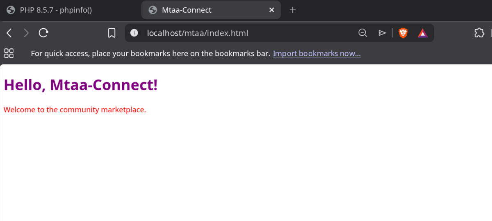

**Fig 3: PHP test page with phpinfo() output**  

**Fig 4: Database connection success message**  
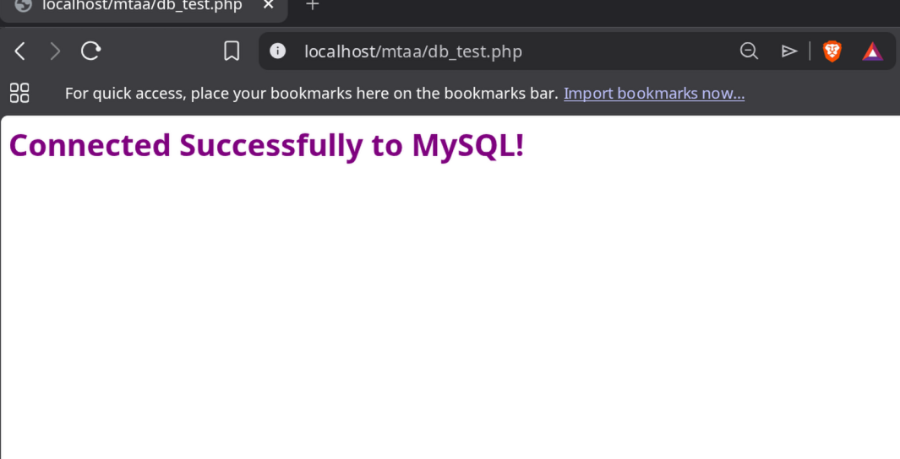

**Fig 5: phpMyAdmin login page**  
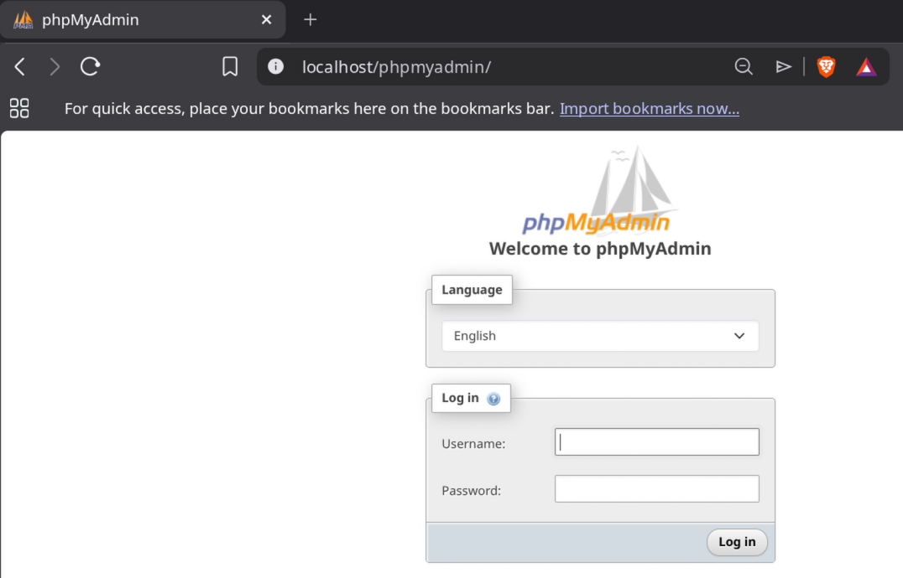

**Fig 6: Project folder structure in the terminal**  
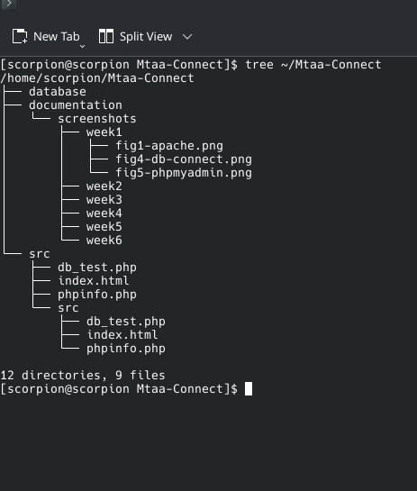

### Student Reflection (100 words)

I installed Apache, MariaDB, and PHP on Arch Linux to set up a local development environment for Mtaa‑Connect. The main challenge was configuring Apache to parse PHP – I had to uncomment the `LoadModule` directive in `httpd.conf` and restart the service. I then created a simple HTML page with the project's purple and red theme, a PHP info page to verify the installation, and a database connection script using `mysqli_connect()`. The connection returned a success message, confirming that MariaDB is running properly. I also set up phpMyAdmin for visual database management. I organised the project into `src/`, `database/`, and `documentation/` folders to maintain a professional structure. All services are now running correctly on `localhost`, and I have captured screenshots as evidence of each working component.

---

## Week 2: Wireframes and Database Schema  

**Title:** User Interface Planning and System Design for Mtaa‑Connect

### Required Evidence

**Fig 1: Wireframe – Homepage (property grid)**  

**Fig 2: Wireframe – Registration page (role selection)**  

**Fig 3: Wireframe – Landlord Dashboard**  

**Fig 4: Wireframe – Property Detail page**  

**Fig 5: Database schema diagram (tables and relationships)**  

**Fig 6: SQL script executed successfully in phpMyAdmin**  

### Student Reflection (100 words)

This week I designed the wireframes for Mtaa‑Connect, focusing on the landlord and tenant user flows. The homepage prioritises search and discovery, while the registration page includes role selection to separate landlord and tenant experiences. I also designed the database schema with three tables: `users`, `properties`, and `inquiries`. The relationships ensure that properties are linked to landlords and inquiries are linked to both tenants and properties. I created the SQL script and tested it in phpMyAdmin – all tables were created successfully. This foundation will guide the coding in the coming weeks, ensuring a secure and structured backend.

## Week 3: JavaScript Validation and PHP Registration  

**Title:** Frontend Interaction and Backend Foundations for Mtaa‑Connect

### Required Evidence

**Fig 1: Registration form (red/purple theme)**  
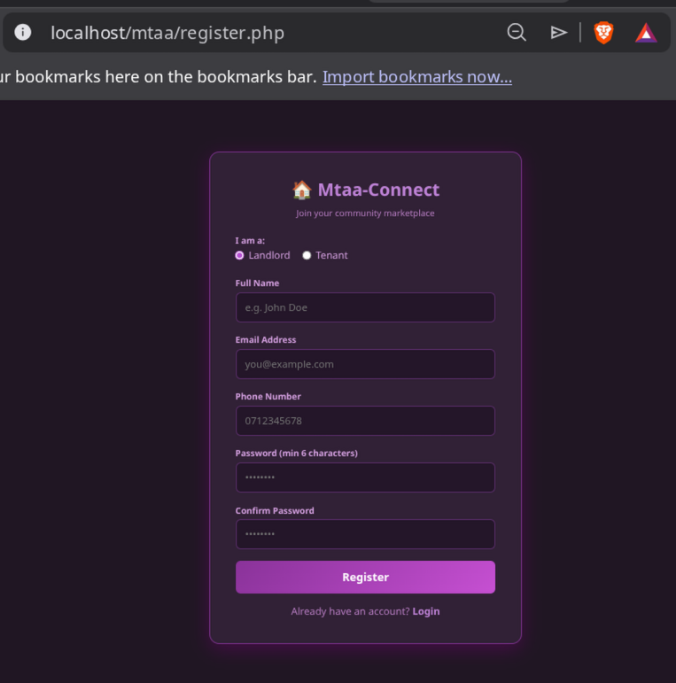

**Fig 2: JavaScript validation errors on empty fields**  
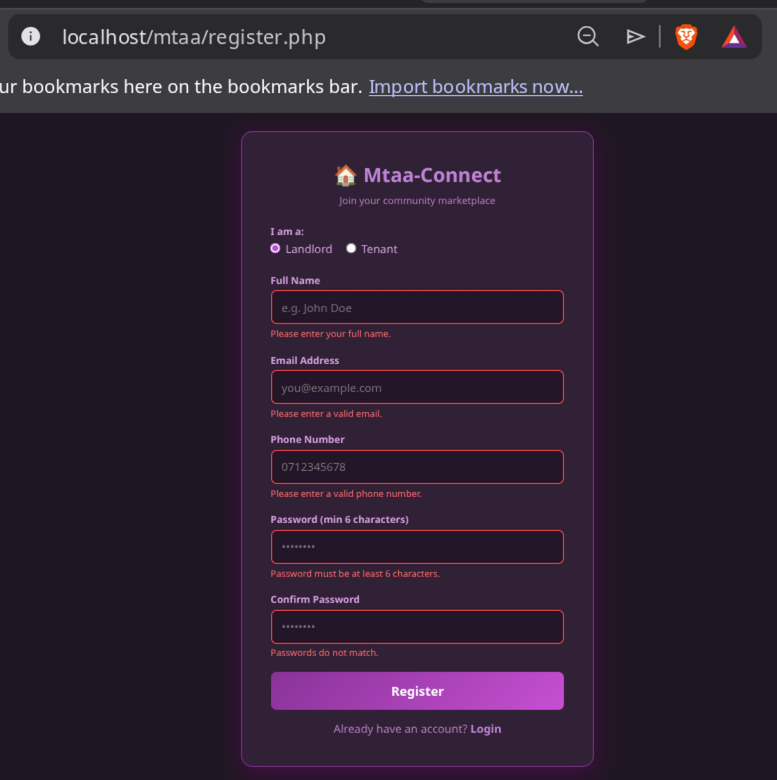

**Fig 3: Password and confirm password validation**  
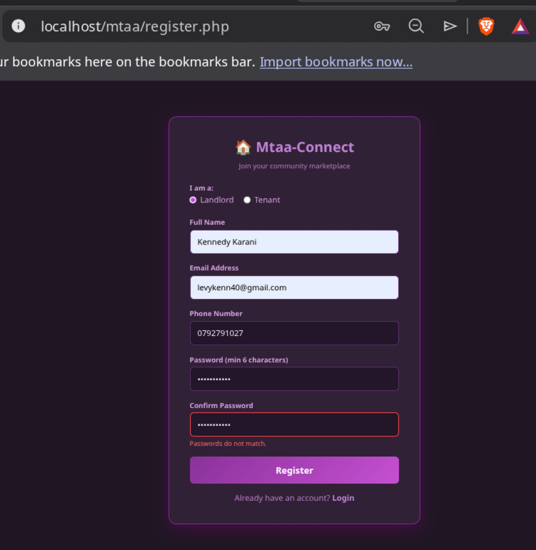

**Fig 4: Successful registration message**  
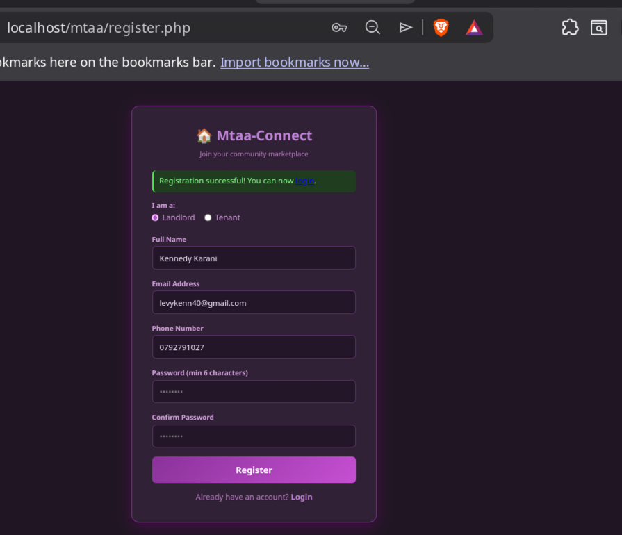

**Fig 5: New user record in the database (phpMyAdmin)**  
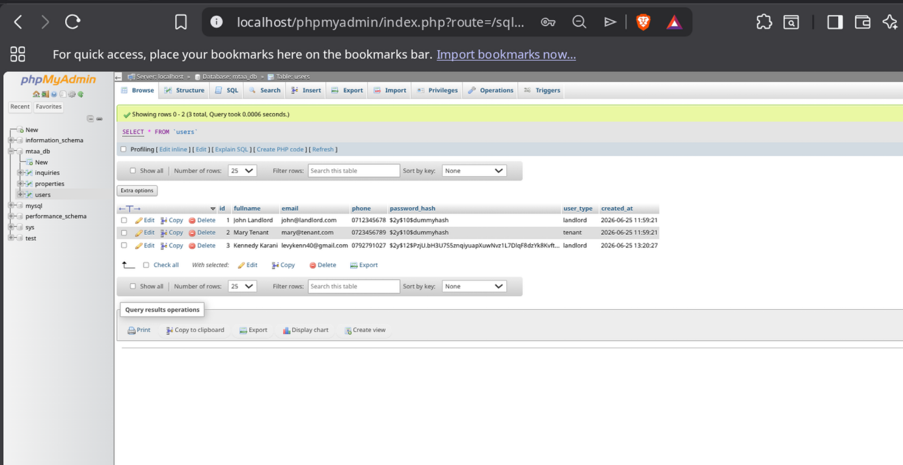

**Fig 6: PHP backend processing code snippet**  

### Student Reflection.

This week I built a registration system for Mtaa‑Connect with both client‑side and server‑side validation. 
The JavaScript checks for empty fields, email format, phone format, password length, and password confirmation before submission. 

On the PHP side, I used `password_hash()` to securely store passwords, `mysqli_real_escape_string()` to prevent SQL injection, and checked for duplicate emails to avoid conflicts. 
The form follows the red and purple colour scheme and is responsive. 

I tested the system with valid and invalid inputs – errors are displayed clearly, and successful registrations save a new user to the `users` table. 
This exercise reinforced the importance of layered validation and secure data handling.

## Week 4: Login System and Session Management  

**Title:** User Authentication and Role‑Based Access for Mtaa‑Connect

### Required Evidence

**Fig 1: Login form (red/purple theme)**  

**Fig 2: JavaScript validation – empty fields**  

**Fig 3: Invalid login attempt error**  

**Fig 4: Landlord dashboard**  

**Fig 5: Tenant dashboard**  

**Fig 6: Logout redirect to login page**  

### Student Reflection.

This week I built the login system for Mtaa‑Connect using PHP sessions and password hashing. 
The login page validates credentials against the `users` table using `password_verify()`. 
On successful login, session variables are set and the user is redirected to a role‑specific dashboard. 
Landlords see property management options, while tenants see search and inquiry options. 
I also implemented a logout that destroys the session. 
The dashboard pages are protected – any direct access redirects to login. 
This provides a secure foundation for future features like property CRUD and inquiries.

## Week 5: Property & Unit CRUD Operations
  
**Title:** Building the Core Portal – Property Management for Landlords and Browsing for Tenants

### Required Evidence

**Fig 1: Add Property form (landlord)**  

**Fig 2: Add Unit form under a property**  
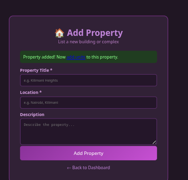

**Fig 3: My Properties page with units listed**  
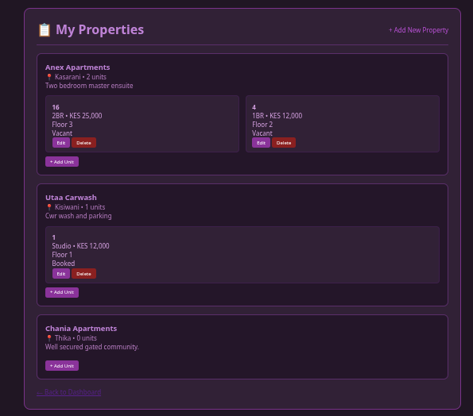

**Fig 4: Browse page (tenant view)**  
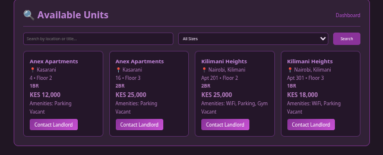

**Fig 5: Search filter working**  
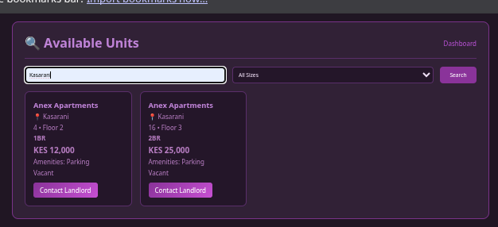

**Fig 6: Database tables (properties + units) in phpMyAdmin**  

### Student Reflection.

This week I built the core functionality of the Mtaa‑Connect portal. 
Landlords can now create properties (buildings/complexes) and add multiple units (apartments/rooms) under each property. 
Each unit stores floor number, house number, size, price, amenities, and status (vacant/occupied/booked). 
Tenants can browse all vacant units with search and filter by location and size. 
This transforms the project from a simple auth system into a fully functional real‑estate marketplace. 
I also learned about foreign keys and cascading deletes to maintain data integrity. 
The portal is now ready for the final phase: inquiries and notifications.

## Week 6: Inquiries and Notifications.

**Title:** Connecting Tenants and Landlords – Inquiry & Reply System

### Required Evidence

**Fig 1: Tenant inquiry form**
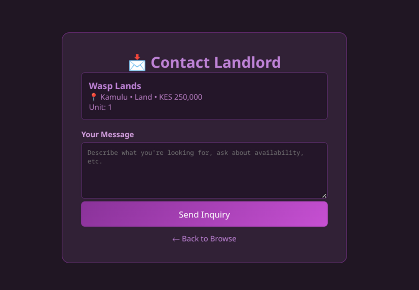

**Fig 2: Inquiry sent confirmation**
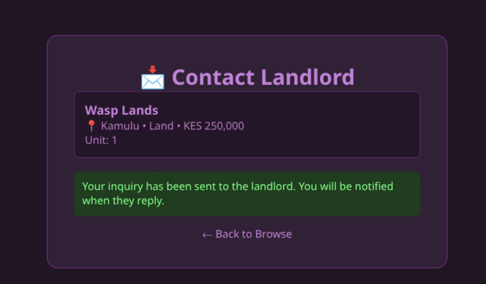

**Fig 3: Landlord dashboard with unread badge**
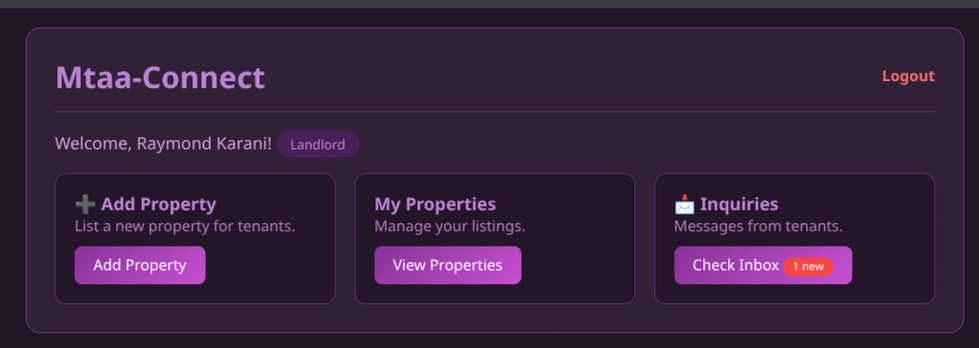

**Fig 4: Inquiries list for landlord**
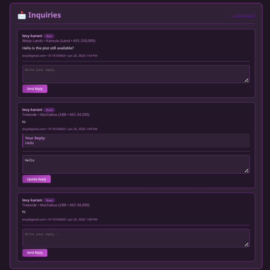

**Fig 5: Landlord reply form**
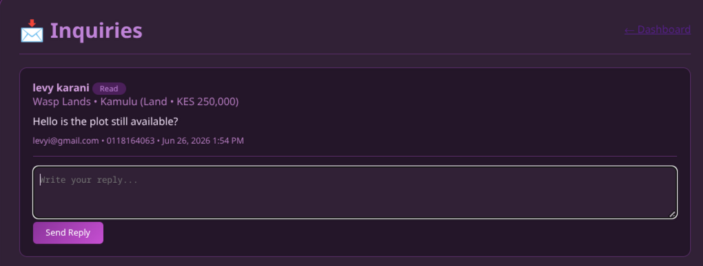

**Fig 6: Tenant inquiry history with reply**
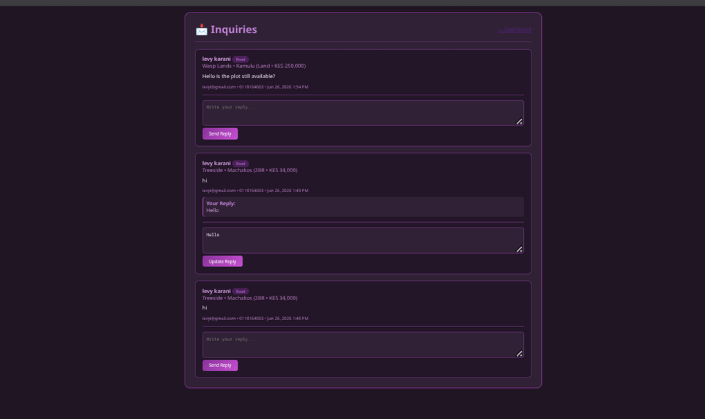

### Student Reflection (100 words)

This week I built the inquiry and notification system, completing the marketplace interaction loop. 
Tenants can now send inquiries about vacant units, and landlords receive them with unread badges. 
Landlords can reply directly from the inquiries page, and tenants can view their inquiry history with landlord responses. 
The system uses a dedicated `inquiries` table with `is_read` and `replied` flags to track communication status. 
I also integrated unread counts into the dashboard, providing real‑time notifications. 
This feature transforms the platform from a static listing site into an interactive marketplace where landlords and tenants can communicate seamlessly.

## Week 7: Architecture & Design (UML, Security)
**Title:** Documenting System Structure and Security Design for Mtaa‑Connect

### Required Evidence

**Fig 1: Multi‑Tier Architecture Diagram**  
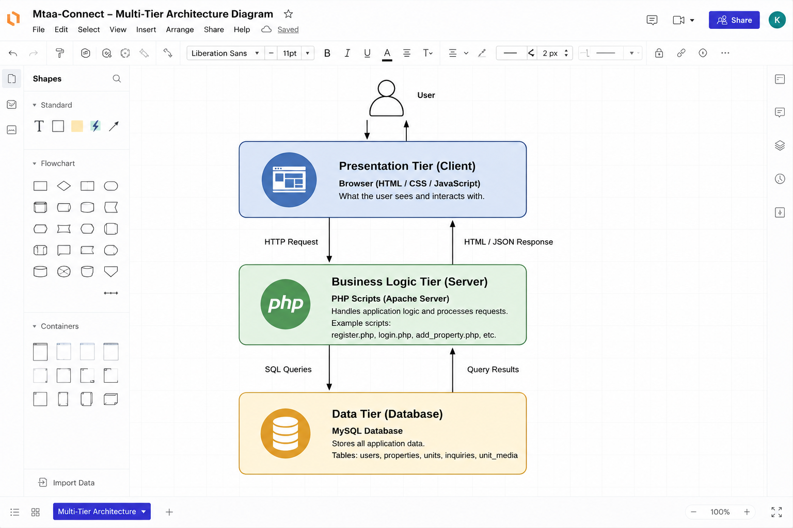

**Fig 2: UML Use Case Diagram**  
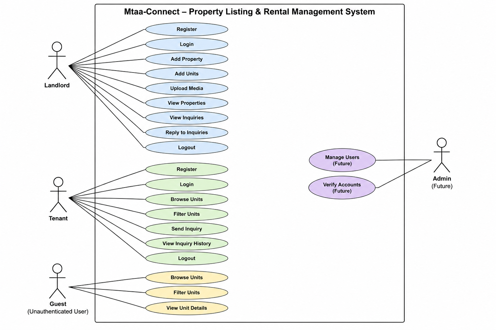

**Fig 3: UML Class Diagram**  
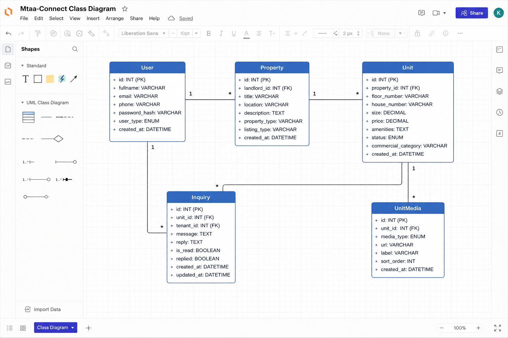

**Fig 4: Database ERD**  
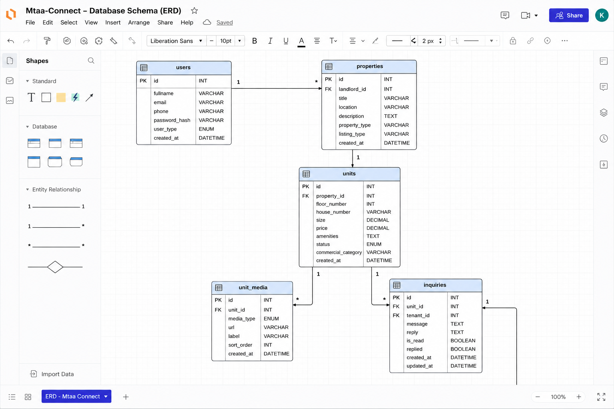

**Fig 5: Security Design Document**  
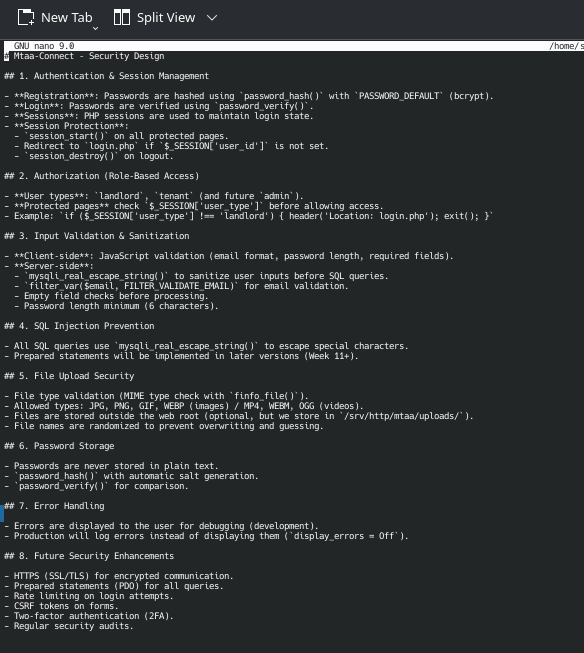

**Fig 6: Additional Design Diagram**  

### Student Reflection.

This week I documented the architecture and design of Mtaa‑Connect using UML diagrams. 
I created a three‑tier architecture diagram showing the presentation (HTML/CSS/JS), business logic (PHP), and data (MySQL) layers. 
The use case diagram identifies three actors: Landlord, Tenant, and Guest, with their respective functionalities. 

The class diagram maps the core entities: User, Property, Unit, UnitMedia, and Inquiry, with their relationships. 
The database ERD visualizes the actual table structures and foreign keys. 
I also wrote a security design document covering authentication, authorization, input validation, SQL injection prevention, and file upload security. 
This documentation helps demonstrate my understanding of system design principles and will be valuable for the final project report.

## Week 8: Responsive Web Design & Mobile‑First UI
**Title:** Making Mtaa‑Connect Fully Responsive with Mobile‑First Approach

### Required Evidence

**Fig 1: Mobile view with hamburger menu open**  
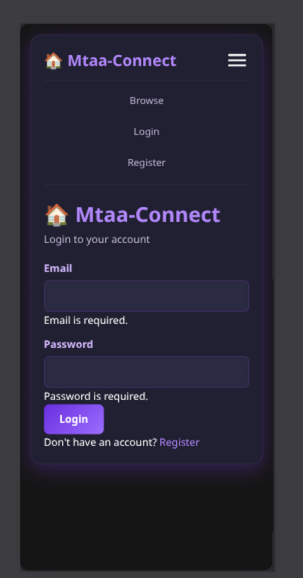

**Fig 2: Mobile view – browse page (filters stacked)**  
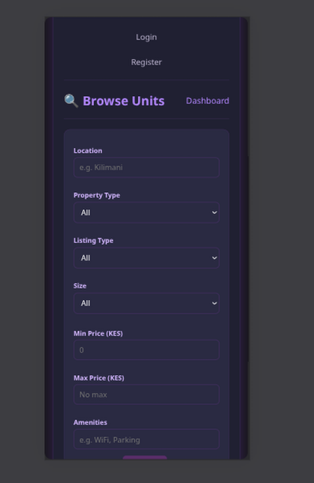

**Fig 3: Tablet view – dashboard with 2‑column layout**  
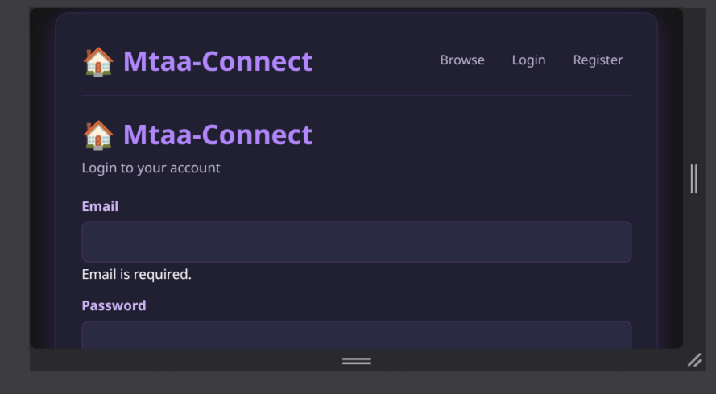

**Fig 4: Desktop view – browse with 3‑column grid**  
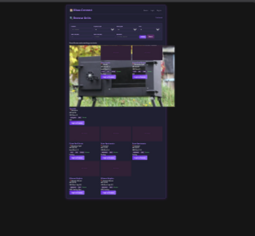

**Fig 5: Mobile‑first form (registration/inquiry)**  
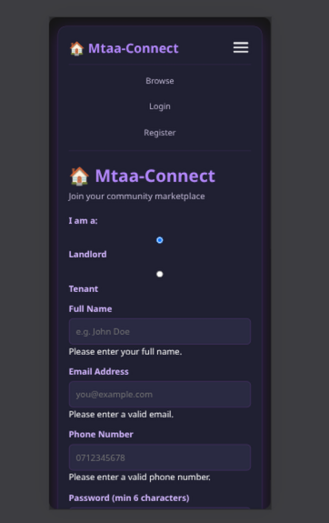

**Fig 6: CSS file with media queries**  
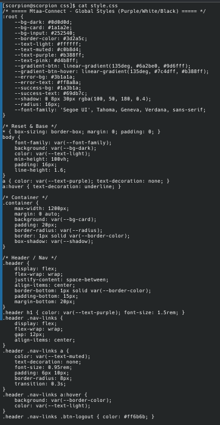

### Student Reflection 

This week I transformed Mtaa‑Connect into a fully responsive, mobile‑first web application. 
I consolidated all styles into a single `style.css` file and used CSS Grid and Flexbox for layouts. 
I implemented a hamburger menu for mobile navigation that toggles smoothly. Using media queries, I created breakpoints at 768px (tablet) and 1024px (desktop) to adapt the UI. 
The browse page now shows filters stacked on mobile and inline on desktop, while unit cards adjust from 1 column to 3+ columns. 
I tested the responsive design using Chrome DevTools on multiple device sizes. 
The result is a portal that works seamlessly on phones, tablets, and desktops, making it accessible to all users.
