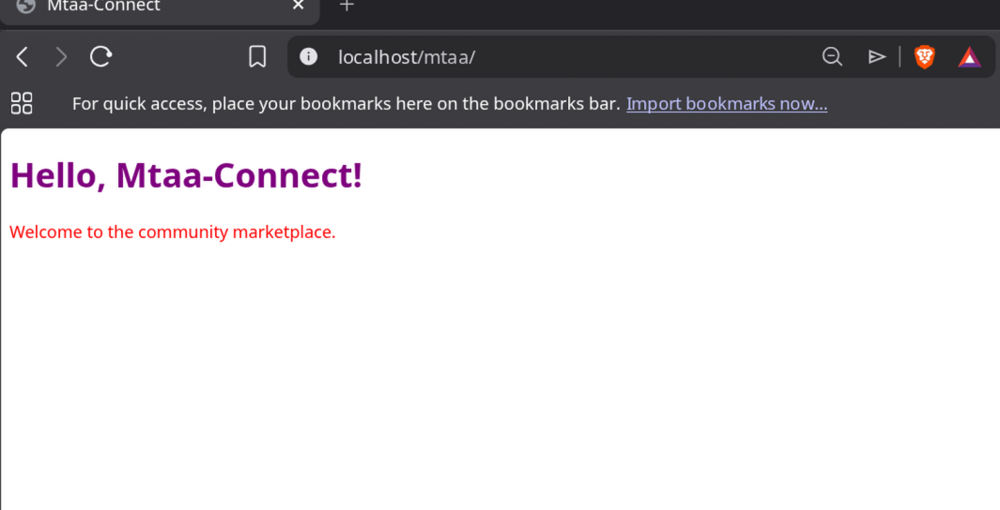
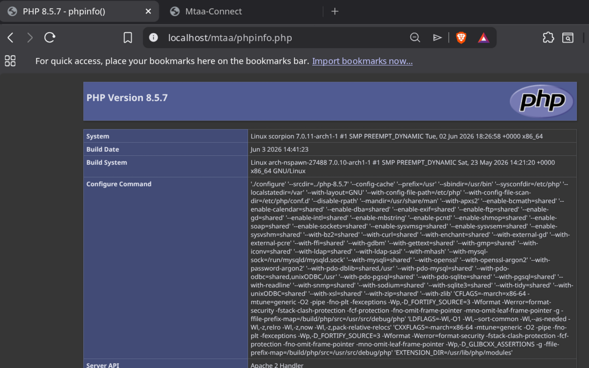
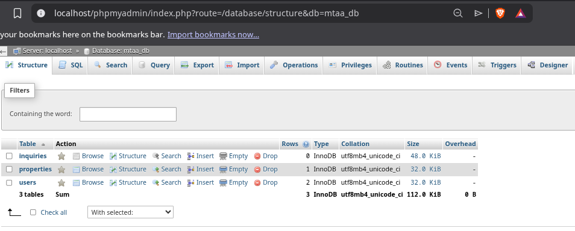

# Mtaa-Connect – Logbook of Practical Progress

## Week 1: Local Environment Setup  

**Title:** Installation and Testing of Local Development Environment for Mtaa-Connect

### Required Evidence

**Fig 1: Apache default page running on localhost**  

**Fig 2: HTML Hello World test page (Mtaa-Connect branding)**  

**Fig 3: PHP test page with phpinfo() output**  

**Fig 4: Database connection success message**  

**Fig 5: phpMyAdmin login page**  

**Fig 6: Project folder structure in the terminal**  

### Student Reflection 

I installed Apache, MariaDB, and PHP on Arch Linux to set up a local development environment for Mtaa‑Connect. 
The main challenge was configuring Apache to parse PHP – I had to uncomment the `LoadModule` directive in `httpd.conf` 
and restart the service. 
I then created a simple HTML page with the project's purple and red theme, a PHP info page to verify the installation, and a database connection script using
 `mysqli_connect()`. The connection returned a success message, confirming that MariaDB is running properly. I also set up phpMyAdmin for visual database management. 
I organized the project into `src/`, `database/`, and `documentation/` folders to maintain a professional structure. 
All services are now running correctly on `localhost`, and I have captured screenshots as evidence of each working component.

## Week 2: Wireframes and Database Schema  
**Title:** User Interface Planning and System Design for Mtaa‑Connect

### Required Evidence

**Fig 1: Wireframe – Homepage (property grid)**  

**Fig 2: Wireframe – Registration page (role selection)**  

**Fig 3: Wireframe – Landlord Dashboard**  

**Fig 4: Wireframe – Property Detail page**  

**Fig 5: Database schema diagram (tables and relationships)**  

**Fig 6: SQL script executed successfully in phpMyAdmin**  

### Student Reflection 

This week I designed the wireframes for Mtaa‑Connect, focusing on the landlord and tenant user flows. 
The homepage prioritises search and discovery, while the registration page includes role selection to separate landlord and tenant experiences. 
I also designed the database schema with three tables: `users`, `properties`, and `inquiries`. 
The relationships ensure that properties are linked to landlords and inquiries are linked to both tenants and properties. 
I created the SQL script and tested it in phpMyAdmin – all tables were created successfully. 
This foundation will guide the coding in the coming weeks, ensuring a secure and structured backend.
